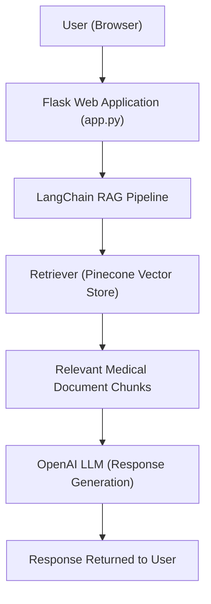
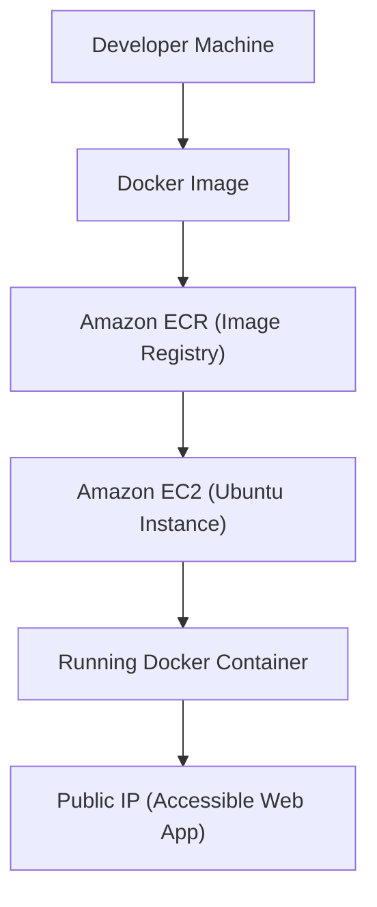

# AI-Powered Medical Assistant/Chatbot using RAG, LangChain & AWS

---
### About The Project

This project implements a real-world production-style AI chatbot system that:
- Loads medical PDFs
- Extracts documents from the PDFs
- Chunks the documents
- Converts them into vector embeddings
- Stores embeddings in Pinecone
- Retrieves relevant context for user queries
- Uses an LLM to generate medically grounded responses
- Serves a web interface via Flask
- Deploys to AWS using Docker, ECR, and EC2

Unlike a generic chatbot, this system uses a custom medical knowledge base, making responses more relevant and context-driven. 
<br>
This basically provides all the help required from doctors, additional assistance system for patients

---
### Project High-Level Architecture

**Tech Stack**
- Backend & Application:
  1. Python – Core programming language
  2. Flask – Web framework for serving chatbot UI
  3. LangChain – RAG orchestration and chain management
  4. OpenAI API – LLM and embeddings
  5. Pinecone – Vector database for similarity search
- Data Processing:
  1. PDF Loader (LangChain)
  2. Text Splitters (Chunking strategy)
  3. OpenAI Embedding Models
- Frontend: Basic client-side interaction via Flask routing
  1. HTML (Jinja Templates)
  2. CSS (Static assets)
- DevOps & Cloud:
  1. Docker – Containerization
  2. Amazon ECR – Container registry
  3. Amazon EC2 – Hosting environment
  4. IAM – Access management
  5. GitHub Actions – CI/CD automation
- Development Tools:
  1. VS Code / PyCharm
  2. AWS CLI
  3. Git & GitHub
  4. Virtual Environment (venv)

**Architecture Components**

|Layer|Component|Responsibility|
|----------|--------|-----------|
|Presentation Layer|Flask + HTML Templates|User interface & request handling|
|Application Layer|LangChain|Orchestrates RAG pipeline|
|Embedding Layer|OpenAI Embeddings|Converts text to vectors|
|Retrieval Layer|Pinecone|Vector similarity search|
|Generation Layer|OpenAI GPT|Response generation|
|Deployment Layer|Docker + AWS|Containerization & hosting|

**Architecture Flowchart**



**Deployment Architecture (AWS)**



<u>CI/CD</u>:

GitHub Push → GitHub Actions → Build → Push to ECR → Deploy to EC2

---
### Project Structure

```
MedicalChatbot/
│
├── .github/workflows/     # CI/CD configuration
├── data/                  # Medical documents (PDFs)
├── research/              # Experiment notebooks
├── src/                   # Core logic
├── static/                # CSS / frontend assets
├── templates/             # HTML templates
├── app.py                 # Flask entrypoint
├── store_index.py         # Embedding & indexing script
├── Dockerfile
├── requirements.txt
├── setup.py
└── README.md
```

---
### Local Setup
1. Clone Repository:
```bash
git clone https://github.com/AishwaryaMaddula/MedicalChatbot.git
cd MedicalChatbot
```
2. Create Virtual Environment:
```bash
python -m venv venv
source venv/bin/activate   # Mac/Linux
venv\Scripts\activate      # Windows
```
3. Install Dependencies:
```bash
pip install -r requirements.txt
```
4. Environment Variables: Create a .env file and add following keys:
```bash
OPENAI_API_KEY=
PINECONE_API_KEY=
```
**Make sure .env is in .gitignore.**

---
### Running the Project

1. Create Pinecone Index:

Run ingestion script to embed and store documents:
```bash
python store_index.py
```
2. Start Flask App:
```bash
python app.py
```
Visit: `http://localhost:8080` to view the application

**AWS Deployment (Production)**

Local → Docker → Amazon ECR → EC2 → Running Container

1. Create IAM User:
   - This user performs:
     - Build docker image of the source code
     - Push docker image to ECR 
     - Launch EC2 
     - Pull image from ECR in EC2 
     - Launch docker image in EC2
   - Name it as "medical-chatbot" 
   - Grant following policies:
      - EC2 access: It is virtual machine<br>
     ```bash
      AmazonEC2FullAccess
     ```
      - ECR: Elastic Container registry to save your docker image in aws<br>
     ```bash
      AmazonEC2ContainerRegistryFullAccess
     ```
   - Configure AWS CLI:<br> 
     ```bash
     aws configure
     ```
2. For the created user, generate access key and secret key.
3. Create ECR Repository and copy repository URI:
```bash
<aws_account_id>.dkr.ecr.us-east-1.amazonaws.com/medical-chatbot
```
4. Create EC2 Instance (region can be us-east-1. ensure HTTPS, HTTP and SSH authentication types are selected)
5. Launch EC2 Instance and Install Docker on EC2:
```bash
#optinal

sudo apt-get update -y

sudo apt-get upgrade

#required

curl -fsSL https://get.docker.com -o get-docker.sh

sudo sh get-docker.sh

sudo usermod -aG docker ubuntu

newgrp docker
```
6. Configure EC2 as self hosted runner: Go to <br>`Github Repository Settings -> Actions -> Runners -> New Self-hosted runner -> Select Linux -> run displayed commands in EC2 one by one `
7. Setup github secrets:
   - AWS_ACCESS_KEY_ID
   - AWS_SECRET_ACCESS_KEY
   - AWS_DEFAULT_REGION
   - ECR_REPO
   - PINECONE_API_KEY
   - OPENAI_API_KEY
8. Create yaml file that contains CI/CD workflow: `
.github/workflows/cicd.yml`<br>
Add template in yaml file to include following:
- Trigger<br>
Run on push to main
- CI Job
   - Checkout repository
   - Configure AWS credentials
   - Login to Amazon ECR
   - Build Docker image
   - Tag image
   - Push image to ECR
- CD Job
   - Depend on CI job
   - Run on self-hosted (EC2) runner
   - Login to ECR
   - Pull latest image
   - Run Docker container
   - Expose application port

